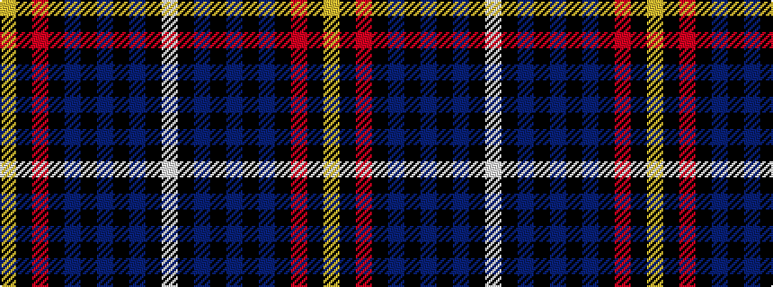

WKBKBKBKRKY

It is a 11 stripe tartan.

<figure class="pat-woven">

<figcaption>idealised sample</figcaption>
</figure>

## Colour Sequence



## Tartans with this colour sequence

| Tartans |
|---------------|
| [MacCandlish Dress Grey](/variants/s11/lb3k1do12k1do1k2do1k6o12k1lo1~x4/)|
||
