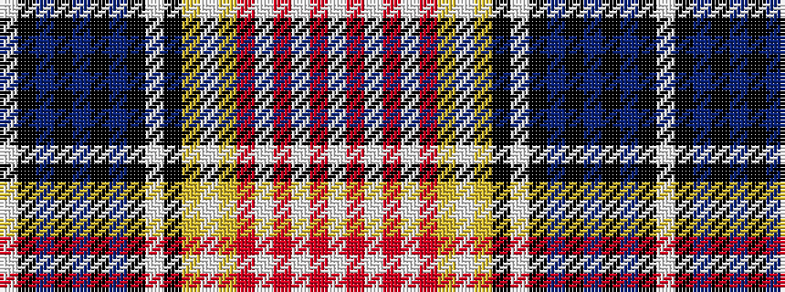

WKBKBKBKWKYWYRWRWRW

It is a 19 stripe tartan.

<figure class="pat-woven">

<figcaption>idealised sample</figcaption>
</figure>

## Colour Sequence



## Tartans with this colour sequence

| Tartans |
|---------------|
| [German](/setts/s19/w7k1db16k2db1k2db4k8w2k8ly8w2ly8r8w2r8w2r1w4~x2/)|
||
