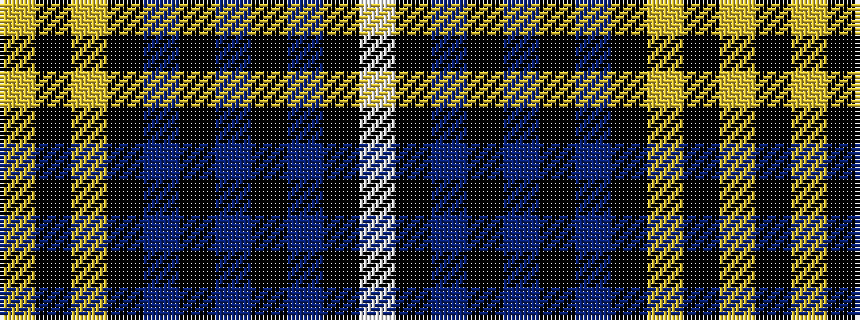

WKBKBKBKYKY

It is a 11 stripe tartan.

<figure class="pat-woven">

<figcaption>idealised sample</figcaption>
</figure>

## Colour Sequence



## Tartans with this colour sequence

| Tartans |
|---------------|
| [McCandlish Dress, Grey (Name)](/setts/s11/lb3k1n12k1n1k2n1k6lr12k1lo1~x4/)|
||
