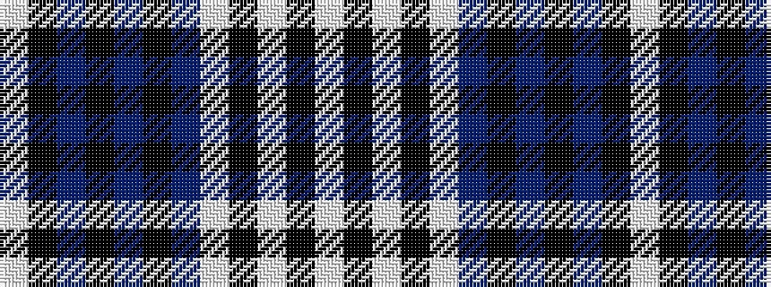

WKBKBKBWKWKW

It is a 12 stripe tartan.

<figure class="pat-woven">

<figcaption>idealised sample</figcaption>
</figure>

## Colour Sequence



## Tartans with this colour sequence

| Tartans |
|---------------|
| [Menzies Black Dress](/setts/s12/w4k1w2k3w23db5k3db1k1db1k19w2~x2/)|
||
