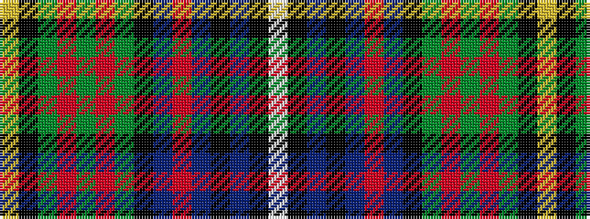

WKBKBRBKGRGRGKY

It is a 15 stripe tartan.

<figure class="pat-woven">

<figcaption>idealised sample</figcaption>
</figure>

## Colour Sequence



## Tartans with this colour sequence

| Tartans |
|---------------|
| [Unidentified Flora MacDonald](/setts/s15/w6k1db30k24db20r30db18k24dg16r3dg3r3dg10k1ly6~x2/)|
||
| [Unidentified, Flora MacDonald](/setts/s15/w6k1db30k24db20r30db18k24g16r3g3r3g10k1ly6~x2/)|
||
