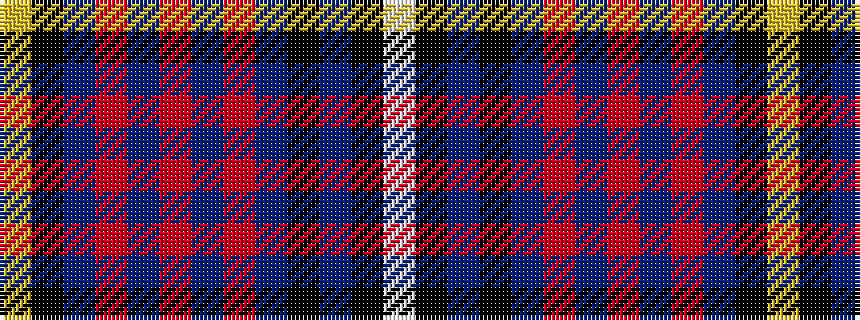

WKBKBRBRBRBKY

It is a 13 stripe tartan.

<figure class="pat-woven">

<figcaption>idealised sample</figcaption>
</figure>

## Colour Sequence



## Tartans with this colour sequence

| Tartans |
|---------------|
| [Aberdale (Fashion)](/setts/s13/lb4k1db14k8db6r2db6r3db6r2db6k2lo2~x2/)|
||
