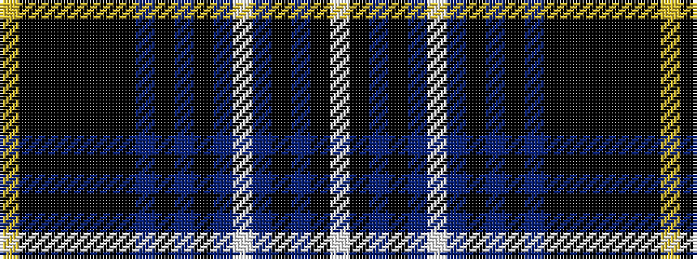

WKBKBWBKBKBKKKKKKY

It is a 18 stripe tartan.

<figure class="pat-woven">

<figcaption>idealised sample</figcaption>
</figure>

## Colour Sequence



## Tartans with this colour sequence

| Tartans |
|---------------|
| [Van Ingelgem (Personal)](/variants/s18/ly3k18ki3k3ki3k3ki18n3k3n3k3n12w2n12k9n12k2w2~x2/)|
||
