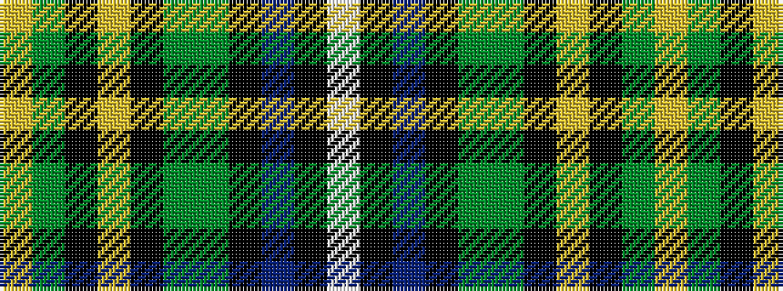

WKBKGGKYKGY

It is a 11 stripe tartan.

<figure class="pat-woven">

<figcaption>idealised sample</figcaption>
</figure>

## Colour Sequence



## Tartans with this colour sequence

| Tartans |
|---------------|
| [Gilhooley (Name)](/variants/s11/ly7gi1k1ly2k9g22gi7k27b4k3w4~x2/)|
||
