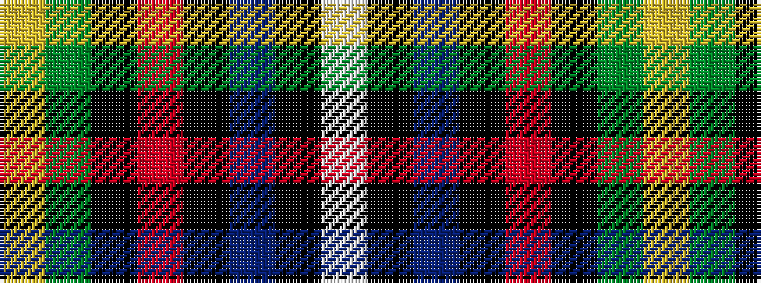

WKBKRKGY

It is a 8 stripe tartan.

<figure class="pat-woven">

<figcaption>idealised sample</figcaption>
</figure>

## Colour Sequence



## Tartans with this colour sequence

| Tartans |
|---------------|
| [Ayre (Personal)](/variants/s8/ly3y14k9r2k9db18k3w1~x2/)|
||
