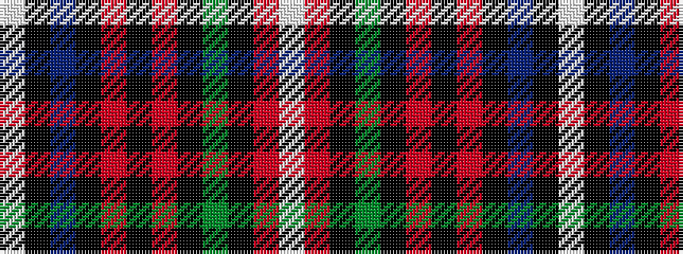

WKBKRKRKGKRW

It is a 12 stripe tartan.

<figure class="pat-woven">

<figcaption>idealised sample</figcaption>
</figure>

## Colour Sequence



## Tartans with this colour sequence

| Tartans |
|---------------|
| [Auld Lang Syne Blue](/variants/s12/w4k2b9k3m3k3m3k23g10k2m6w2~x2/)|
||
