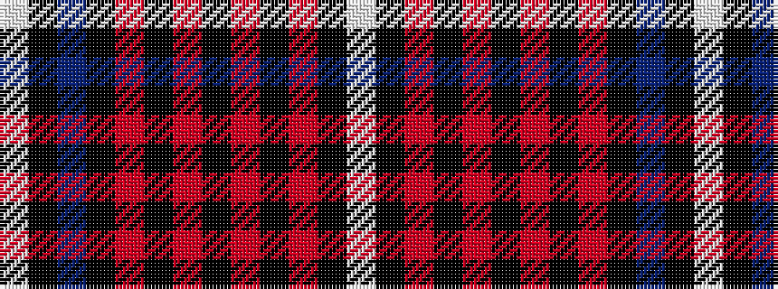

WKBKRKRKRKRKW

It is a 13 stripe tartan.

<figure class="pat-woven">

<figcaption>idealised sample</figcaption>
</figure>

## Colour Sequence



## Tartans with this colour sequence

| Tartans |
|---------------|
| [Danish](/setts/s13/w8k1r24k2r4k2r1k2r4k2db20k1w5~x2/)|
||
