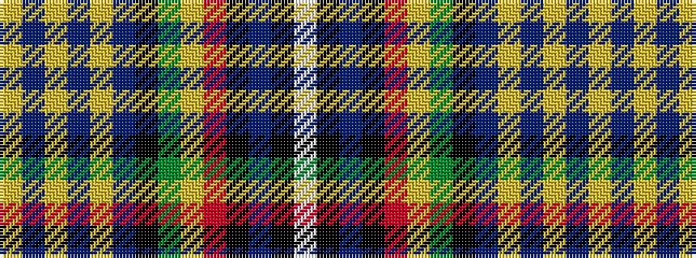

WKBKRYGKBYBYBY

It is a 14 stripe tartan.

<figure class="pat-woven">

<figcaption>idealised sample</figcaption>
</figure>

## Colour Sequence



## Tartans with this colour sequence

| Tartans |
|---------------|
| [Ethiopia](/setts/s14/w4k1b24k1r8lo8g8k1b16lo2b1lo2b1lo4~x2/)|
||
