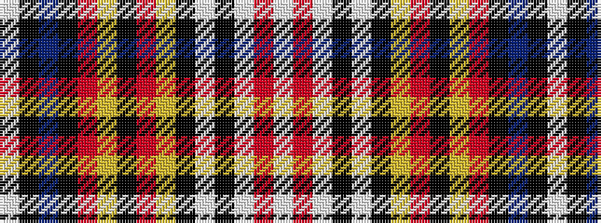

WKBKRYKRYKWKWRW

It is a 15 stripe tartan.

<figure class="pat-woven">

<figcaption>idealised sample</figcaption>
</figure>

## Colour Sequence



## Tartans with this colour sequence

| Tartans |
|---------------|
| [Uganda](/setts/s15/w4r2w1k2w8k6ly6r6k6ly6r6k1db16k1w4~x2/)|
||
