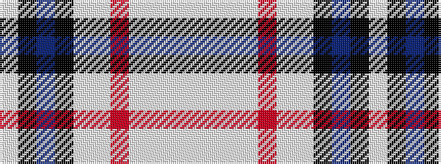

WKBKWWRWWWW

It is a 11 stripe tartan.

<figure class="pat-woven">

<figcaption>idealised sample</figcaption>
</figure>

## Colour Sequence



## Tartans with this colour sequence

| Tartans |
|---------------|
| [Tricotisse](/variants/s11/w9k2t9k1lb9w12o2w12lb24w9lb9~x2/)|
||
