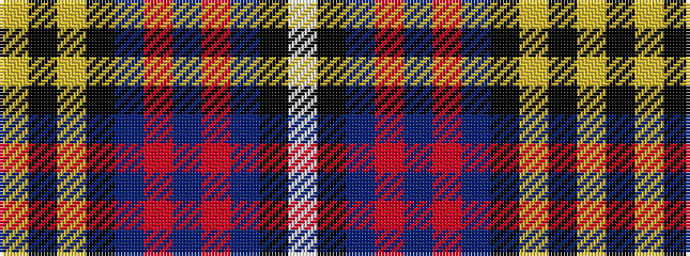

WKBRBRBKYKY

It is a 11 stripe tartan.

<figure class="pat-woven">

<figcaption>idealised sample</figcaption>
</figure>

## Colour Sequence



## Tartans with this colour sequence

| Tartans |
|---------------|
| [Liddell (New York) (Name)](/variants/s11/w2k1t22r1t3r1t8k22ly2k3ly2~x2/)|
||
