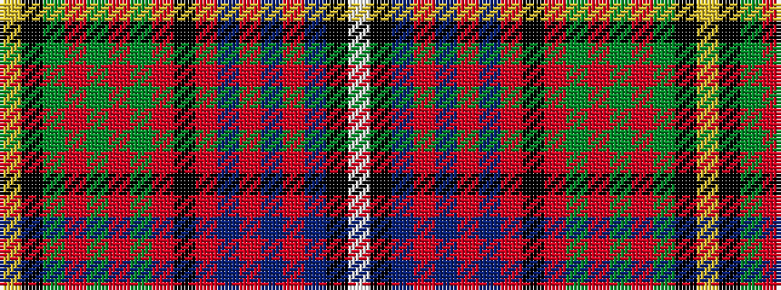

WKBRBRBRKRGRGRGKY

It is a 17 stripe tartan.

<figure class="pat-woven">

<figcaption>idealised sample</figcaption>
</figure>

## Colour Sequence



## Tartans with this colour sequence

| Tartans |
|---------------|
| [Victoria City of Gardens (Fashion)](/variants/s17/w2k1db1r1db1r2db25r1k4r1g25r2g1r1g1k1ly2~x2/)|
||
