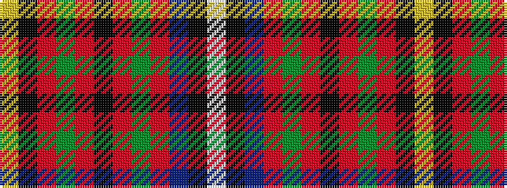

WKBRGRKRGRKY

It is a 12 stripe tartan.

<figure class="pat-woven">

<figcaption>idealised sample</figcaption>
</figure>

## Colour Sequence



## Tartans with this colour sequence

| Tartans |
|---------------|
| [Royal Scottish P.B. Assoc. (Corp.)](/variants/s12/lb6k1t20r2g3r2k15r2g3r2k6ly3~x2/)|
||
