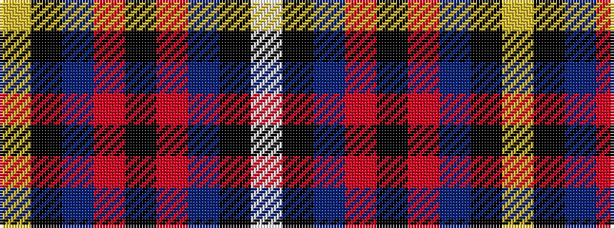

WKBRKRBKY

It is a 9 stripe tartan.

<figure class="pat-woven">

<figcaption>idealised sample</figcaption>
</figure>

## Colour Sequence



## Tartans with this colour sequence

| Tartans |
|---------------|
| [Highland Park](/setts/s9/lo2k3db6r4k48r4db6k3lb2~x2/)|
||
