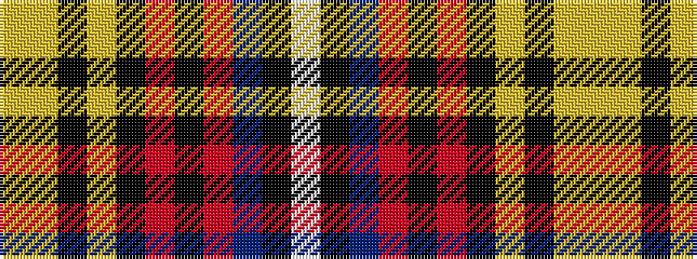

WKBRKRKYKYY

It is a 11 stripe tartan.

<figure class="pat-woven">

<figcaption>idealised sample</figcaption>
</figure>

## Colour Sequence



## Tartans with this colour sequence

| Tartans |
|---------------|
| [Laois County Crest (Fashion)](/setts/s11/ly9lo3k4lo4k8r17k3r17db8k4w4~x2/)|
||
