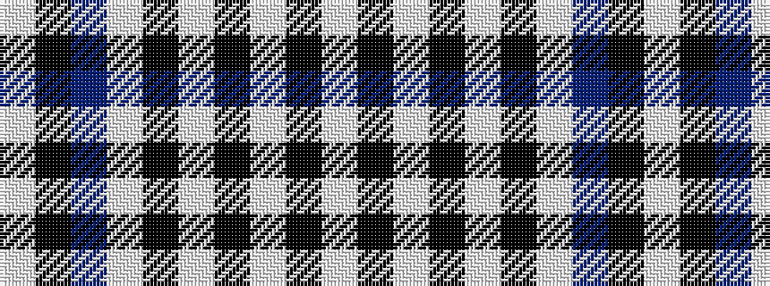

WKBWKWKWKW

It is a 10 stripe tartan.

<figure class="pat-woven">

<figcaption>idealised sample</figcaption>
</figure>

## Colour Sequence



## Tartans with this colour sequence

| Tartans |
|---------------|
| [Investors Group](/setts/s10/lb7k2w2k2w2k2lb7t4k10w2~x4/)|
||
