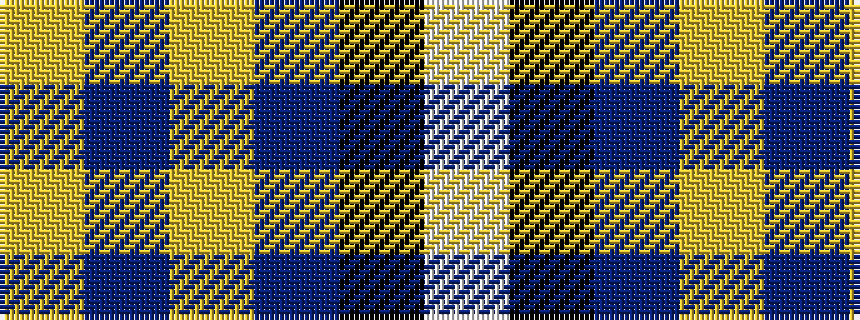

WKBYBY

It is a 6 stripe tartan.

<figure class="pat-woven">

<figcaption>idealised sample</figcaption>
</figure>

## Colour Sequence



## Tartans with this colour sequence

| Tartans |
|---------------|
| [British Energy Corporate Tartan Tartan Number: 2324. Earliest known date: 1996 Nothing See products available Copyright © Blair Urquhart, Comrie, 2015](/setts/s6/lb40k14dp22ly1dp1ly3~x2/)|
||
