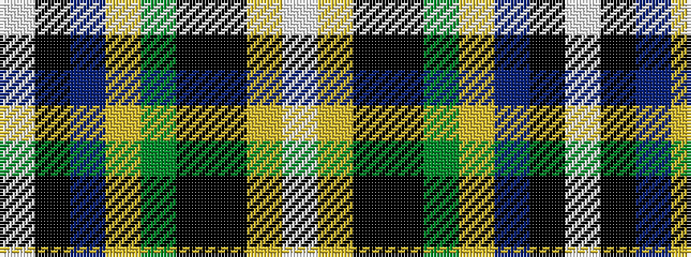

WKBYGKKYW

It is a 9 stripe tartan.

<figure class="pat-woven">

<figcaption>idealised sample</figcaption>
</figure>

## Colour Sequence



## Tartans with this colour sequence

| Tartans |
|---------------|
| [National Millennium (Commemorative)](/variants/s9/w2k4db16lo12g36k1k6lo2w2~x2/)|
||
