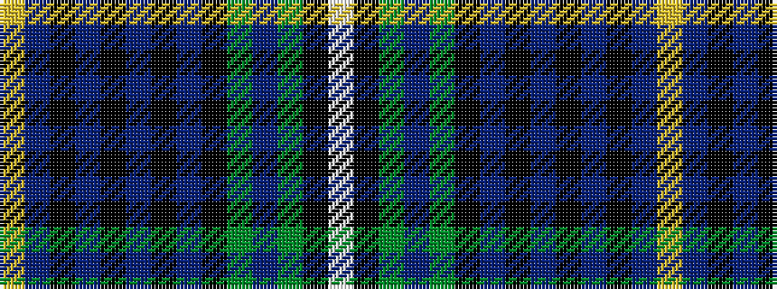

WKGBGKBKBKBKBY

It is a 14 stripe tartan.

<figure class="pat-woven">

<figcaption>idealised sample</figcaption>
</figure>

## Colour Sequence



## Tartans with this colour sequence

| Tartans |
|---------------|
| [Alexander-Johnstone (Personal)](/setts/s14/ly3t2k1t24k2t2k2t2k2g8dp2g8k1w2~x2/)|
||
