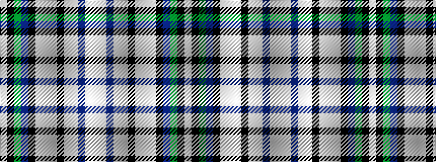

WKGBKWWWKWWBWW

It is a 14 stripe tartan.

<figure class="pat-woven">

<figcaption>idealised sample</figcaption>
</figure>

## Colour Sequence



## Tartans with this colour sequence

This pattern is a design lineage: every tartan below shares one colour order, whatever its owner —
near-identical designs are grouped, the largest lineage first (#112: the pattern is a tartan's
second parent, beside its family or clan).

<table class="sett-table">
<tbody>
<tr><td><a href="/variants/s14/w1k1y1b8k1lb1w8lb1k8lb1w1b8lb1w1~x6/">Praetorian Imperatur (Fashion)</a></td></tr>
<tr><td class="sett-swatch"></td></tr>
<tr><td><a href="/variants/s14/w1k1y1db8k1lb1w8lb1k8lb1w1db8lb1w1~x6/">Praetorian, Blue (Fashion)</a></td></tr>
<tr><td class="sett-swatch"></td></tr>
<tr class="cluster-sep"><td></td></tr>
<tr><td><a href="/variants/s14/w1ki1y1db8k1lb1w8lb1k8lb1w1db8lb1w1~x6~ki0705267-db1505255/">Praetorian Blue</a></td></tr>
<tr><td class="sett-swatch"></td></tr>
</tbody>
</table>

