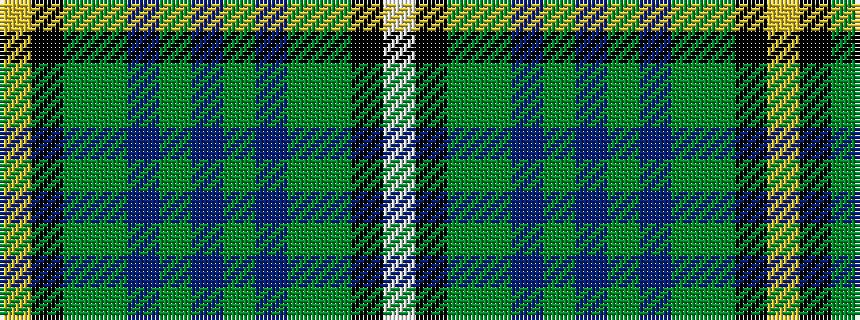

WKGGBGBGBGGKY

It is a 13 stripe tartan.

<figure class="pat-woven">

<figcaption>idealised sample</figcaption>
</figure>

## Colour Sequence



## Tartans with this colour sequence

| Tartans |
|---------------|
| [Campbell Brown](/setts/s13/w9k1dy31dg30db36dg3db3dg3db36dg30dy31k1ly9~x2/)|
||
