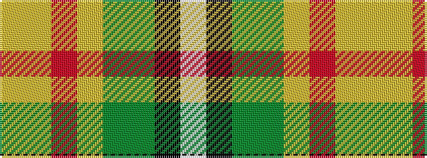

WKGGYRYY

It is a 8 stripe tartan.

<figure class="pat-woven">

<figcaption>idealised sample</figcaption>
</figure>

## Colour Sequence



## Tartans with this colour sequence

| Tartans |
|---------------|
| [Saskatchewan (District)](/variants/s8/w2k1g6dy11lo26r2lo1ly2~x2/)|
||
| [Saskatchewan District Tartan](/variants/s8/w2k1g6dy11ly26r2ly1ly2~x2/)|
||
