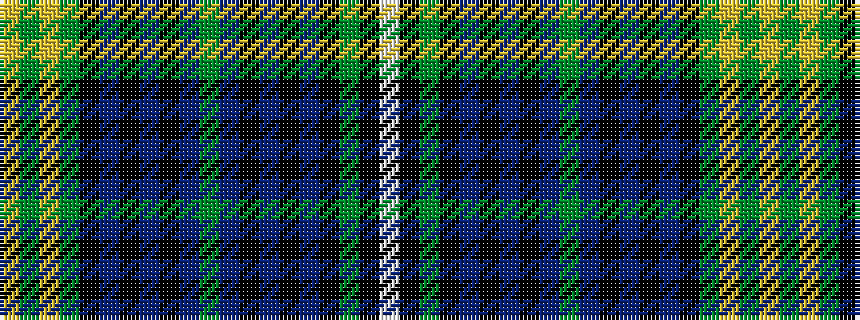

WKGKBKBKBGBKBKBKGYGY

It is a 20 stripe tartan.

<figure class="pat-woven">

<figcaption>idealised sample</figcaption>
</figure>

## Colour Sequence



## Tartans with this colour sequence

| Tartans |
|---------------|
| [Fyvie](/setts/s20/ly5dg2ly2dg15k9db2k2db2k2db9dg5db9k2db2k2db2k9dg15k2w4~x2/)|
||
