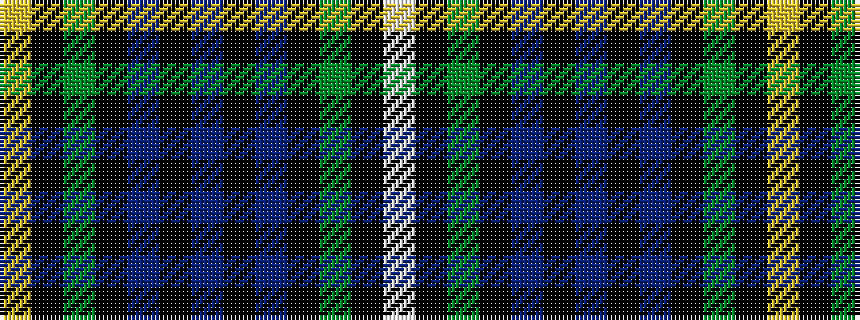

WKGKBKBKBKGKY

It is a 13 stripe tartan.

<figure class="pat-woven">

<figcaption>idealised sample</figcaption>
</figure>

## Colour Sequence



## Tartans with this colour sequence

| Tartans |
|---------------|
| [Campbell Loudon](/variants/s13/ly2k1dg12k12db12k1db2k1db12k12dg12k1lb2~x2/)|
||
| [Campbell of Loudoun](/variants/s13/w2k1dg12k12db12k1db1k1db12k12dg12k1ly2~x2/)|
||
| [Campbell of Loudoun (Clan)](/variants/s13/w1k1g7k8db7k1db2k1db7k8g7k1ly1~x4/)|
||
| [Campbell of Loudoun Clan Tartan](/variants/s13/w2k1g12k12db12k1db2k1db12k12g12k1ly2~x2/)|
||
