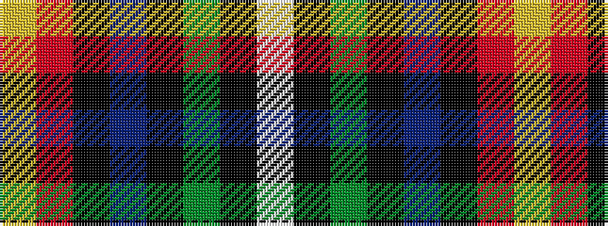

WKGKBKRY

It is a 8 stripe tartan.

<figure class="pat-woven">

<figcaption>idealised sample</figcaption>
</figure>

## Colour Sequence



## Tartans with this colour sequence

| Tartans |
|---------------|
| [German MacLeod](/variants/s8/ly2r2k2b27k6g13k1lb2~x2/)|
||
