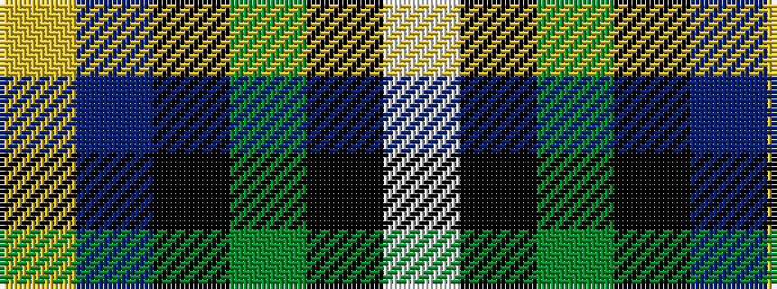

WKGKBY

It is a 6 stripe tartan.

<figure class="pat-woven">

<figcaption>idealised sample</figcaption>
</figure>

## Colour Sequence



## Tartans with this colour sequence

| Tartans |
|---------------|
| [Widows Sons Scotland (MRA)](/setts/s6/lb9k16dg10k22dp67lo4/)|
||
