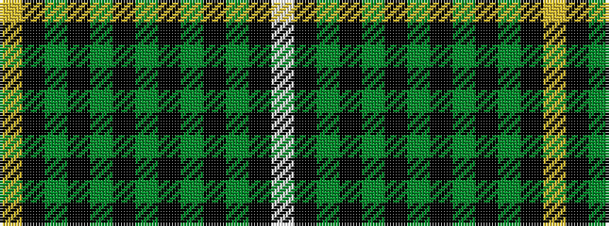

WKGKGKGKGKGKY

It is a 13 stripe tartan.

<figure class="pat-woven">

<figcaption>idealised sample</figcaption>
</figure>

## Colour Sequence



## Tartans with this colour sequence

| Tartans |
|---------------|
| [Robieson, Graham A. (Personal)](/setts/s13/w1ki1dg8ki1dg1k8dg1ki8dg1k1dg8ki1ly1~x6/)|
||
| [Robieson, Graham Alexander (Personal)](/setts/s13/w1k1dg8k1dg1ki8dg1k8dg1ki1dg8k1ly1~x6/)|
||
