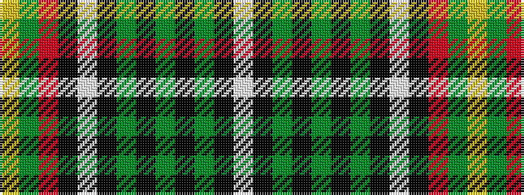

WKGKGKGKWKRGY

It is a 13 stripe tartan.

<figure class="pat-woven">

<figcaption>idealised sample</figcaption>
</figure>

## Colour Sequence



## Tartans with this colour sequence

| Tartans |
|---------------|
| [Kapasi (Personal)](/setts/s13/lo2g6r12k3w3k3g16k2g2k2g2k12lp2~x2/)|
||
