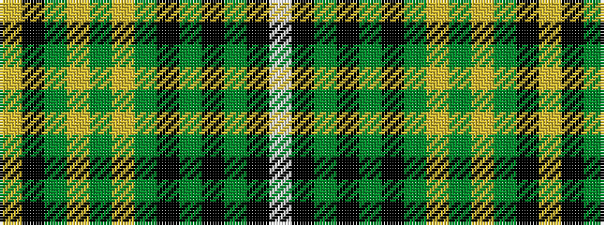

WKGKGKGYGYGKY

It is a 13 stripe tartan.

<figure class="pat-woven">

<figcaption>idealised sample</figcaption>
</figure>

## Colour Sequence



## Tartans with this colour sequence

| Tartans |
|---------------|
| [Unnamed C20th - National Archives](/setts/s13/w2k10dg4k2dg4ki16dg10ly1dg3ly2dg2ki2ly2~x2/)|
||
