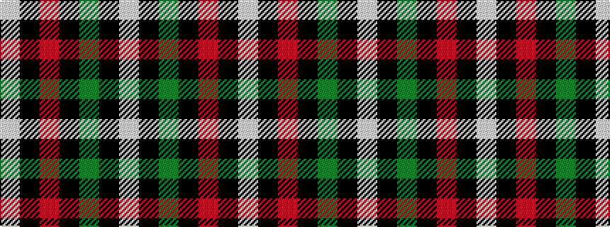

WKGKRKW

It is a 7 stripe tartan.

<figure class="pat-woven">

<figcaption>idealised sample</figcaption>
</figure>

## Colour Sequence



## Tartans with this colour sequence

| Tartans |
|---------------|
| [Prince Edward Island](/variants/s7/w2k1g16k12r12k1w2~x2/)|
||
| [Prince Edward Island #2](/variants/s7/w2k1dg16k12r12k1w2~x2/)|
||
