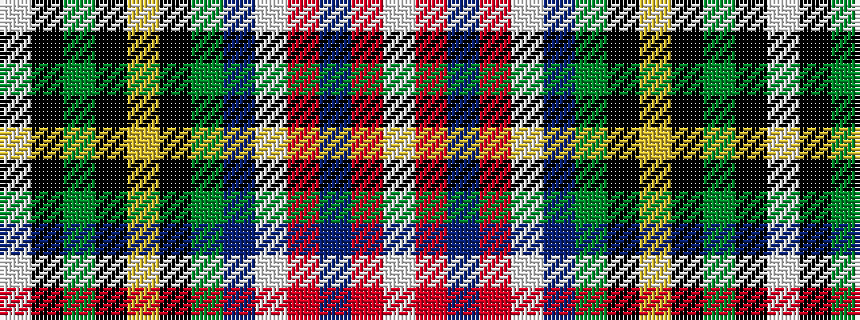

WKGKYKGBWRBRW

It is a 13 stripe tartan.

<figure class="pat-woven">

<figcaption>idealised sample</figcaption>
</figure>

## Colour Sequence



## Tartans with this colour sequence

| Tartans |
|---------------|
| [State Seal of Colorado (Fashion)](/setts/s13/lb4k1dy4k1lo3k1dy4db48lb3r25db4r3lb3~x2/)|
||
