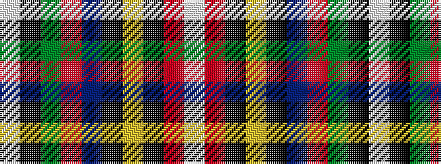

WKGRBKYKRW

It is a 10 stripe tartan.

<figure class="pat-woven">

<figcaption>idealised sample</figcaption>
</figure>

## Colour Sequence



## Tartans with this colour sequence

| Tartans |
|---------------|
| [Loch Lomond & the Trossachs (Fashion](/setts/s10/w2r5k2lo3k4db28r4dg14k4w2~x2/)|
||
