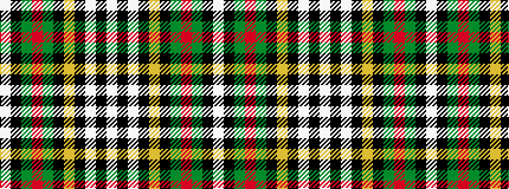

WKGRGKYKWKW

It is a 11 stripe tartan.

<figure class="pat-woven">

<figcaption>idealised sample</figcaption>
</figure>

## Colour Sequence



## Tartans with this colour sequence

| Tartans |
|---------------|
| [Labrador](/variants/s11/lt11k2lt2k2ly2k11g30r2g3k1w5~x2/)|
||
| [Labrador (District)](/variants/s11/lb11k2lb2k2lo2k11dg30r2dg3k1w5~x2/)|
||
