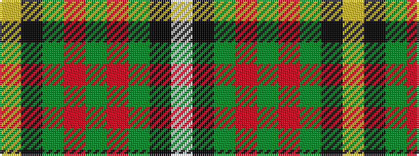

WKGRGRGKY

It is a 9 stripe tartan.

<figure class="pat-woven">

<figcaption>idealised sample</figcaption>
</figure>

## Colour Sequence



## Tartans with this colour sequence

| Tartans |
|---------------|
| [Ellis (Personal)](/setts/s9/w2k1g4r2g2r4g5k1ly2~x6/)|
||
