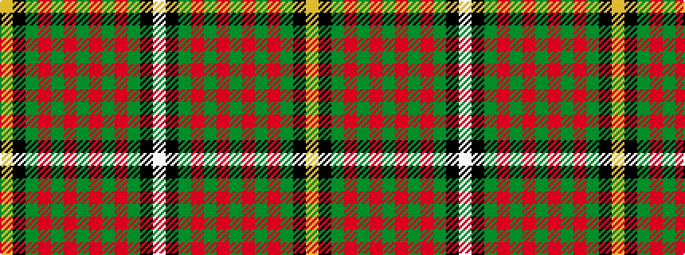

WKGRGRGRGRGKY

It is a 13 stripe tartan.

<figure class="pat-woven">

<figcaption>idealised sample</figcaption>
</figure>

## Colour Sequence



## Tartans with this colour sequence

| Tartans |
|---------------|
| [Bruce Hunting](/variants/s13/w3k1g19r4g3r11g5r11g3r4g19k1ly3~x2/)|
||
