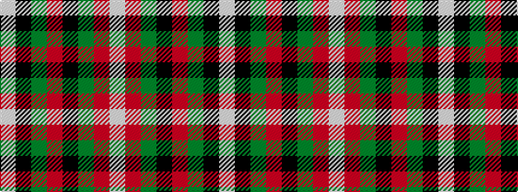

WKGRKGRW

It is a 8 stripe tartan.

<figure class="pat-woven">

<figcaption>idealised sample</figcaption>
</figure>

## Colour Sequence



## Tartans with this colour sequence

| Tartans |
|---------------|
| [Al Suwaidi of Abu Dhabi (Personal)](/variants/s8/w2r7dg7k7r2dg2k2w1~x5/)|
||
