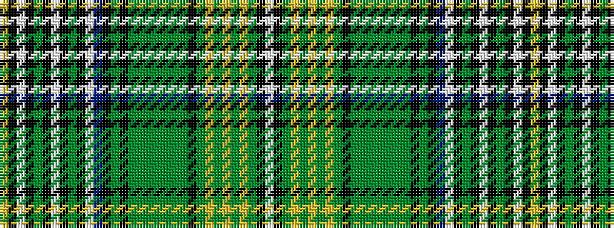

WKGYGYGYGKGGGGGGGKGKBWKGKWKGKWKY

It is a 32 stripe tartan.

<figure class="pat-woven">

<figcaption>idealised sample</figcaption>
</figure>

## Colour Sequence



## Tartans with this colour sequence

| Tartans |
|---------------|
| [Whiskey & Bourbon](/setts/s32/ly8k2w3k4y3k2lb6k2y3k4lb3t44k4y4k4dy5y5dy5y6dy5y5dy5k4dy5ly5dy5ly6dy5ly5dy5k4w6/)|
||
