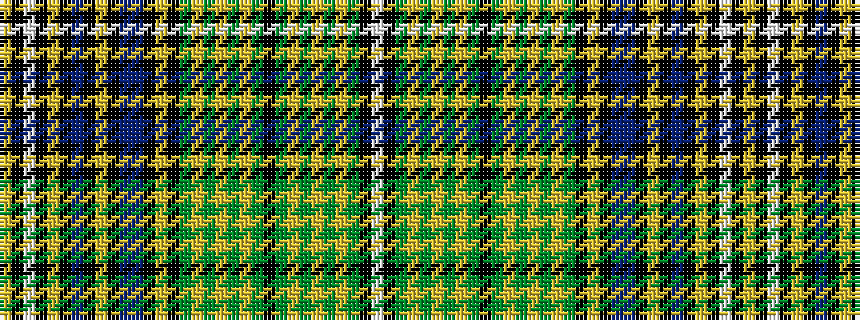

WKGYGYGYGKGYGYGYGKYKBBKYKBKYKWKY

It is a 32 stripe tartan.

<figure class="pat-woven">

<figcaption>idealised sample</figcaption>
</figure>

## Colour Sequence



## Tartans with this colour sequence

| Tartans |
|---------------|
| [Whiskey & Bourbon (Corporate)](/variants/s32/ly8k2w3k4lo3k2t6k2lo3k4t3db44k4lo4k4dy5lo5dy5lo6dy5lo5dy5k4dy5ly5dy5ly6dy5ly5dy5k4w6/)|
||
