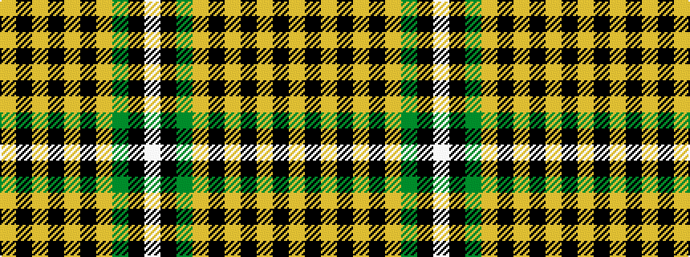

WKGYKYKYKY

It is a 10 stripe tartan.

<figure class="pat-woven">

<figcaption>idealised sample</figcaption>
</figure>

## Colour Sequence



## Tartans with this colour sequence

| Tartans |
|---------------|
| [Scruffy Wallace](/variants/s10/w6k3g24lg16k6lg6k6lg6k60lg6/)|
||
