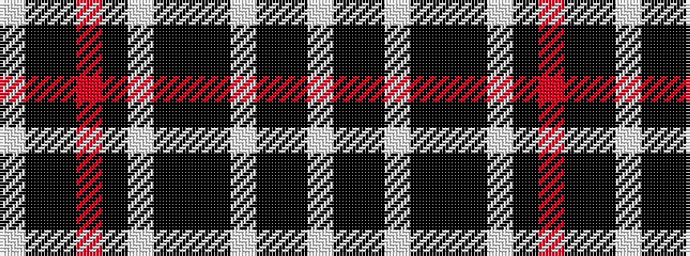

WKKRKWKKKWKKW

It is a 13 stripe tartan.

<figure class="pat-woven">

<figcaption>idealised sample</figcaption>
</figure>

## Colour Sequence



## Tartans with this colour sequence

| Tartans |
|---------------|
| [Wcwm 972-2](/setts/s13/lb7k1k1o2k18lb2k1k2k1lb6k1k1lb1~x4/)|
||
