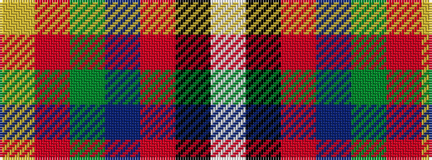

WKRBGRY

It is a 7 stripe tartan.

<figure class="pat-woven">

<figcaption>idealised sample</figcaption>
</figure>

## Colour Sequence



## Tartans with this colour sequence

| Tartans |
|---------------|
| [East Kilbride](/variants/s7/lo3r10dg7db10r15k1w2~x2/)|
||
| [East Kilbride (Original) District Tartan](/variants/s7/ly3r10g7db10r15k1w2~x2/)|
||
