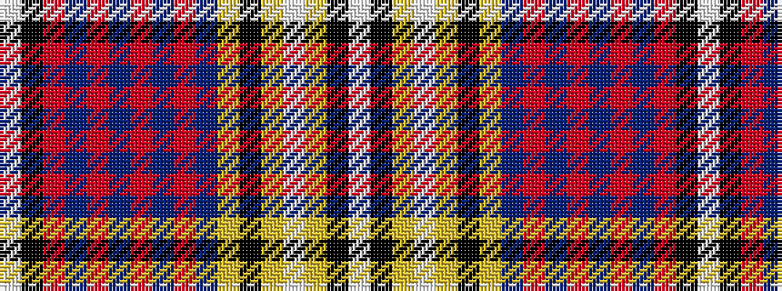

WKRBRBRBRBYKYWYKW

It is a 17 stripe tartan.

<figure class="pat-woven">

<figcaption>idealised sample</figcaption>
</figure>

## Colour Sequence



## Tartans with this colour sequence

| Tartans |
|---------------|
| [Cornish Pascoe (Name)](/variants/s17/wi2k32o5n3o2n3o2n3o1n6ly3k2ly1w3ly2k2wi1~x2/)|
||
