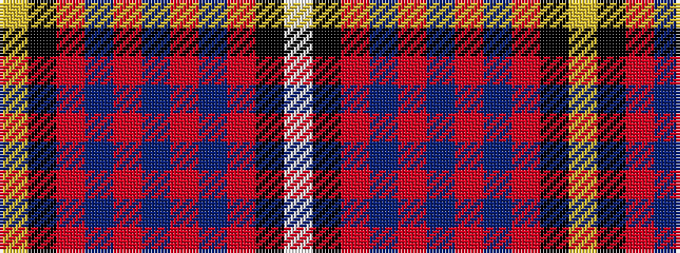

WKRBRBRBRKY

It is a 11 stripe tartan.

<figure class="pat-woven">

<figcaption>idealised sample</figcaption>
</figure>

## Colour Sequence



## Tartans with this colour sequence

| Tartans |
|---------------|
| [MacKeever](/setts/s11/w4k1r12db3r3db16r3db3r12k1ly4~x2/)|
||
