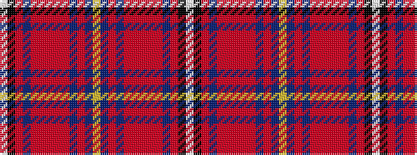

WKRBRRRRRBRBYBRBRRRRRBRKW

It is a 25 stripe tartan.

<figure class="pat-woven">

<figcaption>idealised sample</figcaption>
</figure>

## Colour Sequence



## Tartans with this colour sequence

| Tartans |
|---------------|
| [Fitzgerald Dress (Name)](/variants/s25/w2k1r3db3r3ri3r12ri3r3db3r6db19ly3db19r3db3r3ri3r12ri3r3db3r3k1w2~x2/)|
||
