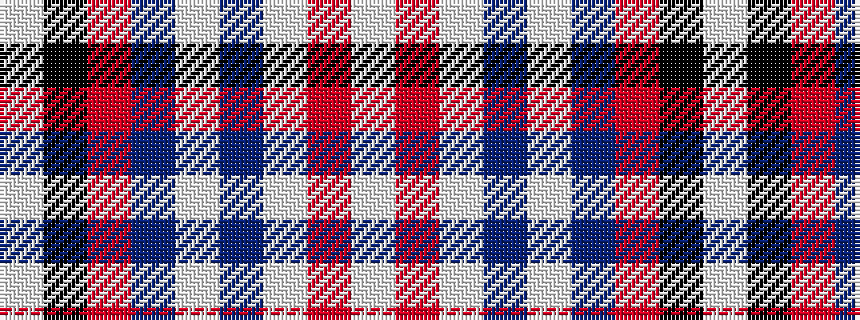

WKRBWBWRW

It is a 9 stripe tartan.

<figure class="pat-woven">

<figcaption>idealised sample</figcaption>
</figure>

## Colour Sequence



## Tartans with this colour sequence

| Tartans |
|---------------|
| [Hebridean Fire](/setts/s9/lb4r2lb7n30lb8n7r5k1w2~x2/)|
||
