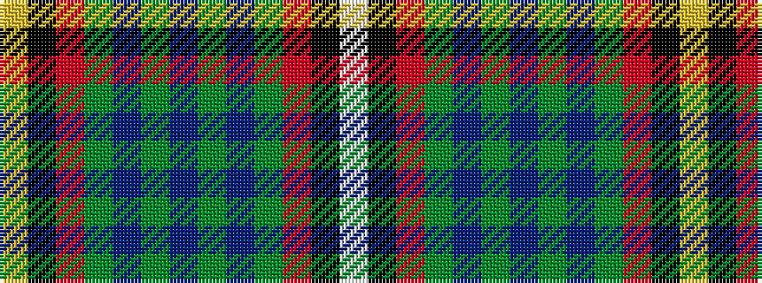

WKRGBGBGBGRKY

It is a 13 stripe tartan.

<figure class="pat-woven">

<figcaption>idealised sample</figcaption>
</figure>

## Colour Sequence



## Tartans with this colour sequence

| Tartans |
|---------------|
| [Campbell, Brown (Personal)](/variants/s13/w9k1o31g30db36g3db3g3db36g30o31k1ly9~x2/)|
||
